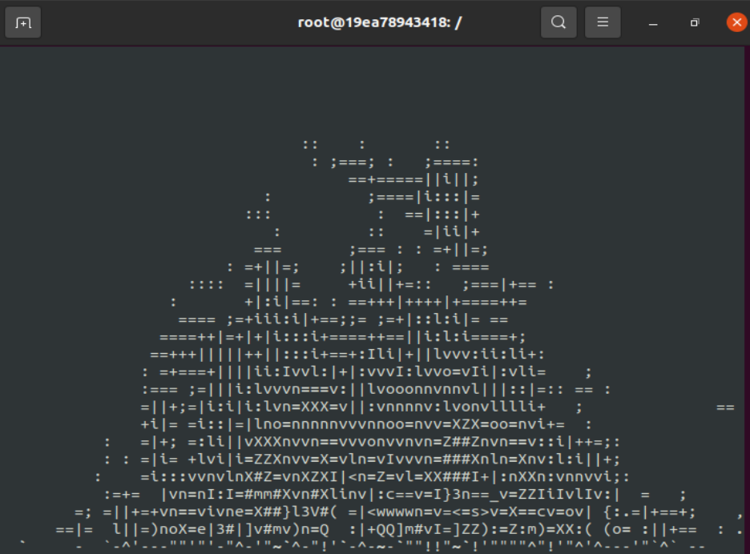
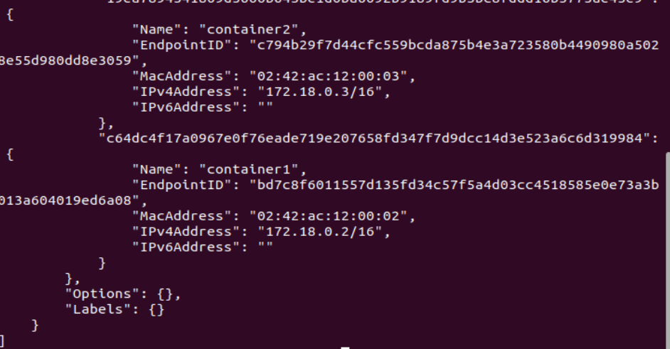

# Лабораторный отчет 4

### ФИО: Нгуен Динь Нам - К3140

## Выполните лабораторную работу 4.

1.  Установка Docker и проверка версии

- Чтобы проверить текущую версию docker, я использую команду: 
```
docker --version
```

- 

***Docker установлен успешно***

2. Создайте Dockerfile

- Создать пустой файл с именем `Dockerfile`
```
touch Dockerfile
```

- Дать этому файлу права на выполнение.
```
chmod +x Dockerfile

```

- Чтобы проверить права на выполнение файла, используйте следующую команду:

```
ls -l Dockerfile
```
- 

- Затем используйте gedit для записи в Dockerfile следующим образом:

- 

*Эти строки кода помогают создать контейнер на основе последней версии операционной системы Ubuntu и установить необходимые пакеты для запуска приложения `aafire`, `ping`*

3. Построение Docker image
- После создания Dockerfile, соберите образ с помощью команды `sudo docker build -t aafire .`

-  
   
- Используйте команду `sudo docker images`, чтобы проверить созданные образы docker.
  
- 
  
4. Запуск контейнеров
- После того как образ был собран, запустите два контейнера с приложением aafire с помощью команды `docker run -it --name container1 aafire` и `docker run -it --name container2 aafire`.
  
- Это результат работы двух контейнеров:

- 
- *container1*
- 
- *container2*
  
5. Создание сети
- Используйте команду `sudo docker ps` для проверки запущенных контейнеров.
  
- 
  
- Создайте сеть Docker с именем `myNetwork`: 
  
- 
  
- Подключите контейнеры к сети:
  
- 
  
- Затем подключите 2 контейнера с именами *"container1"* и *"container2"* для подключения к сети `myNetwork`:
  
```
sudo docker network connect myNetwork container1
sudo docker network connect myNetwork container2
```
- Проверьте настройки сети с помощью команды `sudo docker network inspect myNetwork`:
  
- 
- 
*«container1» и «container2» успешно подключились к myNetwork.*

6. Проверка соединения между контейнерами
- Проверьте соединение между двумя контейнерами с помощью команды `ping`.
- Войдите в  «container1» с помощью команды `sudo docker exec -it container1 bash`.
- Затем выполните ping-«container2».
  
- 
  
- Аналогичным образом зайдите в «container2» и выполните ping-«container1».
  
- 
*2 контейнера успешно соединились*

- После этого прекратите запуск двух контейнеров, чтобы избежать переполнения памяти, с помощью команды `sudo docker stop`.
  
- 
  
- Используйте команду `sudo docker ps` для проверки запущенных контейнеров.
  
- 